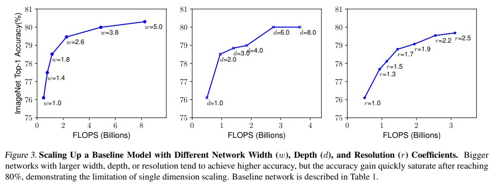

# EfficientNet review

&nbsp;

## Abstract

Convolutional Neural Network (ConvNets)는 더 나은 결과를 얻기 위해서는 스케일업(scale-up)을 수행해야 한다. 이 논문에서는 모델 스케일업하는 방법과 새로운 baseline network(EfficientNet)를 제안한다. 다양한 관찰을 통해 저자는 기존의 세 dimension 중 하나만을 스케일업하는 기법들과는 달리, two or three dimension을 스케일업하는 방법을 통해 더 나은 정확도를 창출할 수 있다고 한다. dimension에는 depth/width/resolution 이 있다. 또한, MobileNets과 ResNet을 능가하는 모델 *EfficientNet*을 제안한다. ResNet 보다 파라미터 수도 적고, 정확도도 좋으며 속도까지 빠른 모델이라고 한다.

&nbsp;

&nbsp;

## 1. Introduction

보통 ConvNet의 성능을 향상시키기 위해서는 스케일업을 한다. 예를 들어 ResNet-18 보다 ResNet-200이 더 많은 레이어를 가짐으로써 더 좋은 성능을 가진다. 이는 depth 즉 layer의 수를 증가시키는 기법이다. 또는 width 즉 channel의 수를 증가시키는 방법도 있다. 흔하진 않지만, image 해상도를 늘려 성능을 올릴 수도 있다.

이처럼, 보통은 depth, width, image size 하나만을 증가시킨다. 그 이유는 최적의 값을 찾기도 힘들 뿐더러, 서로 독립적인 관계라고 생각했기 때문이다.

&nbsp;

그러나 이 논문에서는 세 개중 두 가지 또는 세 가지를 증가시키는 방법을 사용했다. 증가시킬 때는 밸런스를 유지하면서 증가시켜줘야 효과적이다.

저자는 기존의 방식에서 새로운 방식을 생각하기 위해 정확도와 효율성을 향상시키기 위해서는 scale up을 수행하는 것이 원초적인 방법인가에 대한 질문을 조사했다. 이에 대한 조사를 통해 depth/width/resolution 세 가지 dimension에 대한 밸런스가 중요하다는 것을 깨달았고, 밸런스를 위한 파라미터(scaling coefficients)는 간단한 grid search를 통해 찾을 수 있었다. 이러한 방법을 *compound scaling method* 라 부른다.

간단하게 생각해보면, 이미지가 커지게 되면, 네트워크는 당연히 receptive field(수용 필드)를 증가시키기 위해 더 많은 레이어와 더 나은 패턴을 탐지하기 위해 더 많은 채널을 필요로 한다. 따라서 이전의 1개씩만 증가시키는 방법과는 달리 밸런스를 유지하며 두 세가지를 증가시키는 것이 더 효율적이다.

&nbsp;

&nbsp;

## 2. Related Work

### ConvNet Accuracy

2014년 ImageNet 우승 모델인 GoogleNet의 경우 74.8% 의 top-1 정확도와 6.8M개의 parameter를 가진 모델이다. 2017년 ImageNet 우승 모델인 SENet은 82.7%의 top-1 정확도와 145M개의 parameter가, 2018년 우승 모델인 GPipe는 84.3%의 top-1 정확도, 557M개의 parameter가 필요하다고 한다. 즉 더 높은 정확도의 모델일수록 더 많은 수의 파라미터가 존재해야 한다. 이는 더 많은 메모리를 필요로 하고, 느린 학습 속도의 한계를 가진다.

&nbsp;

### ConvNet Efficiency

모델의 경량화를 가장 많이 사용되는 기법은 *Model Compression*(Han et al., 2016; He et al., 2018; Yang et al., 2018) 이다. 경량화를 위해 모델 사이즈를 줄이지만, 이를 통해 정확도와 효율성이 감소된다. 모델의 규모는 network의 width/depth/convolution kernel type과 size에 의해 결정된다. 큰 모델은 더 큰 design space를 가지고, 더 많은 튜닝 비용을 필요로 한다. 그래서 이 논문에서는 매우 큰 ConvNet에 대한 모델의 효율성을 조사한다. 

&nbsp;

#### Model Scaling

성능 향상을 위해 ResNet-18에서 ResNet-200으로의 depth(# layers)를 증가시킬 수도 있고, wideResNet(Zagoruyko & Komodakis, 2016)에서와 같이 width(# channels)를 증가시킬 수도 있다. 또는 입력 이미지 크기(resolution)을 증가시켜 효과를 볼 수도 있다. 그러나 이렇게 하면 FLOPS(연산량)이 증가되어 효율성이 떨어질 수 있다.

&nbsp;

&nbsp;

## 3. Compound Model Scaling

이번 섹션에서는 스케일링 문제를 어떻게 풀어냈는지에 대해 설명하고자 한다.

&nbsp;

### 3.1. Problem Formulation

ConvNet layer *i*는 $ Y_i = F_i(X_i) $ 로 표현될 수 있다. 이 때, F_i는 operator, Y_i는 output, X_i는 \<H_i, W_i, C_i\> 의 shape을 가진 input이다. H,W는 공간적 차원(layer i에서의 이미지 크기), C는 채널 차원이다. ConvNet *N* 은 여러 개의 같은 block으로 구성되어 있으므로 N은 다음과 같이 나타낼 수 있다.

이 때, L_i는 반복 번수 이다. ResNet의 경우 맨 처음 downsampling을 위한 convolution을 제외하고는 같은 bottleNeck 또는 basicBlock 형태로 구성된 layer들을 가진다.

&nbsp;

### 3.2. Scaling Dimensions

depth, width, resolution이 각기 다르게 최적화되고, 최적의 값을 찾기 힘들다. 복잡성을 해결하기 위해 아래와 같은 방법으로 스케일링한다.

- Depth(d)
    depth를 스케일링하는 것은 가장 일반적인 방법이다. 하지만 너무 깊은 네트워크는 vanishing gradient(기울기가 0으로 수렴하는 문제)가 발생할 수도 있다. 이를 해결하기 위해 몇몇 기술인 skip connections, batch normalization, dropout 등을 적용하기도 한다. 그러나 명확한 것은 ResNet-1000과 ResNet-101은 거의 동일한 정확도를 가진다는 것이다.

- Width(w)
    모델이 작은 사이즈인 경우 width 스케일링 방법을 주로 사용한다. width가 큰 네트워크는 더 좋은 특징을 탐지하고, 더 쉽게 학습시킬 수 있다.

- Resolution(r)
    높은 해상도의 이미지를 사용하면, 더 좋은 패턴을 탐지할 수 있다. 초기의 convNet은 224x224의 resolution으로 수행했고, 229x229, 331x331 등 다양한 시도들이 있었고, GPipe의 경우 480x480 의 해상도를 사용했다. 더 높은 해상도일수록 더 높은 정확도를 가진다.

세 가지에 대한 그래프는 다음과 같다. 왼쪽부터 width, depth, resolution에 해당한다.

&nbsp;

### 3.3. Compound Scaling

저자는 세 dimension이 서로 독립적이지 않다고 한다. 직관적으로 높은 해상도일수록 더 큰 depth와 더 큰 width를 필요로 한다. 이러한 *balance*에 대한 그래프는 다음과 같다. 

depth와 resolution을 고정시킨 채 width에 대한 변화 그래프를 관찰했다. 결과적으로 세 가지를 모두 높였을 때 가장 좋은 결과를 얻을 수 있었다.

&nbsp;

그래서 세 가지의 dimension의 밸런스에 대한 변수, compound coefficient $ \phi $ 를 제안한다.

$ \alpha, \beta, \gamma $ 는 작은 grid search를 통해 쉽게 찾을 수 있다. FLOPS(연산량)은 각각 d와 w^2, r^2와 비례한다. 총 FLOPS는 $ (\alpha \cdot \beta^2 \cdot \gamma^2)^(\phi) $ 에 비례한다. 이 논문에서는 $ (\alpha \cdot \beta^2 \cdot \gamma^2) \approx 2$ 라는 제약을 두고, $ \phi $ 를 찾는다. 

&nbsp;

&nbsp;

## 4. EfficientNet Architecture

scaling을 아무리 잘해도, baseline network(backbone)가 좋지 않으면 좋은 결과를 얻을 수 없다. 따라서 새로운 좋은 baseline network인 mobile size의 *EfficientNet*을 제안한다.

최적화 목표인 search space는 $ ACC(m) X [FLOPS(m)/T]^w $ 식을 통해 측정된다. 이 때 ACC(m)은 accuracy(정확도), FLOPS(m)는 연산량, m는 model, T는 target FLOPS, w는 acc와 FLOPS의 trade-off 관계에 대한 hyperparameter로 -0.07로 지정했다. latency 대신 FLOPS 지표를 사용하는 이유는 특정 하드웨어에 최적화하는 것이 아닌 모델에 대한 최적의 값을 찾기 위함이다.

초기 모델을 **Efficient-B0** 라 하고, 이 EfficientNet-B0는 squeeze-and-excitaion 기법이 들어있는 bottleneck MBConv(Sandler et al., 2018; Tan et al., 2019)를 사용한다.

baseline network를 EfficientNet-B0로 지정한 후 모델을 스케일업하는 두 단계의 과정이 있다. 세 가지의 dimension의 밸런스를 맞추는 것은 연산량이 많을 수 있으므로, 두 단계로 나누어 진행한다.

- Step 1: 먼저 $ \phi $ 를 1로 고정시킨 후 식 (2),(3)에 의거하여 grid search 기법을 통해 $ \alpha, \beta, \gamma $ 를 찾는다. 저자가 찾은 바로는 $\alpha \cdot \beta^2 \cdot \gamma^2 \approx 2 $ 제약에 한해, $ \alpha = 1.2, \beta = 1.1, \gamma = 1.15 $ 일 때가 가장 성능이 좋았다고 한다.

- Step 2: 찾은 $\alpha,\beta,\gamma$ 를 고정시킨 후 $ \phi $ 를 변화시키면서 최적의 값을 찾는다. 이에 대한 모델을 Efficient-B1 ~ B7이라 한다.

&nbsp;

&nbsp;

## 5. Experiments

| 섹션 5는 hyperparameter만 살펴볼 것이다. 그 이유는 별 다른 내용없이 모델의 우수함만 보여주기 때문이다.

&nbsp;

### 5.1. Scaling Up MobileNets and ResNets

&nbsp;

&nbsp;

### 5.2. ImageNet Results for EfficientNet

- optimizer : RMSProp with decay 0.9, momentum 0.9, batch norm momentum 0.99
- weight decay : 1e-5
- initial learning rate : 0.256, decay 0.97 every 2.4 epochs
- activation : SiLU (Swish-1)
- AutoAugment
- stochastic depth with survival probability 0.8
- dropout ratio : 0.2 ~ 0.5 (B0 ~ B7)

&nbsp;

&nbsp;

### 5.3. Transfer Learning Results for EfficientNet

&nbsp;

&nbsp;

## 6. Discusion

&nbsp;

&nbsp;

## 7. Conclusion

기존의 방식보다 더 쉽게 스케일업하고, 더 나은 방식을 제안했다. 그 결과로 더 적은 파라미터와 더 낮은 FLOPS의 모델을 제안한다.

&nbsp;

&nbsp;

- original tensorflow source code : [https://github.com/tensorflow/tpu/tree/master/models/official/efficientnet.git](https://github.com/tensorflow/tpu/tree/master/models/official/efficientnet.git)
- pytorch source code : [https://github.com/lukemelas/EfficientNet-PyTorch.git](https://github.com/lukemelas/EfficientNet-PyTorch.git)

## thesis
- [EfficientNet: Rethinking Model Scaling for Convolutional Neural Networks](https://arxiv.org/pdf/1905.11946.pdf)

## reference
- https://lynnshin.tistory.com/53
- https://ropiens.tistory.com/110
- https://visionhong.tistory.com/19
- https://wandukong.tistory.com/20
- https://bellzero.tistory.com/17
- https://greeksharifa.github.io/computer%20vision/2022/03/01/EfficientNet/
    
