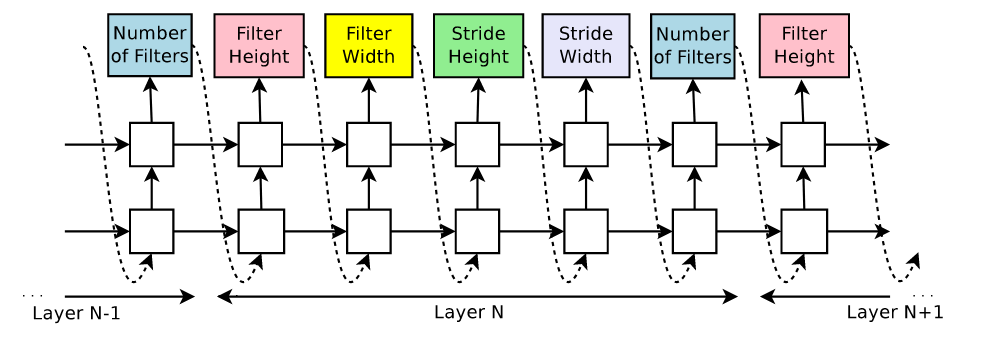
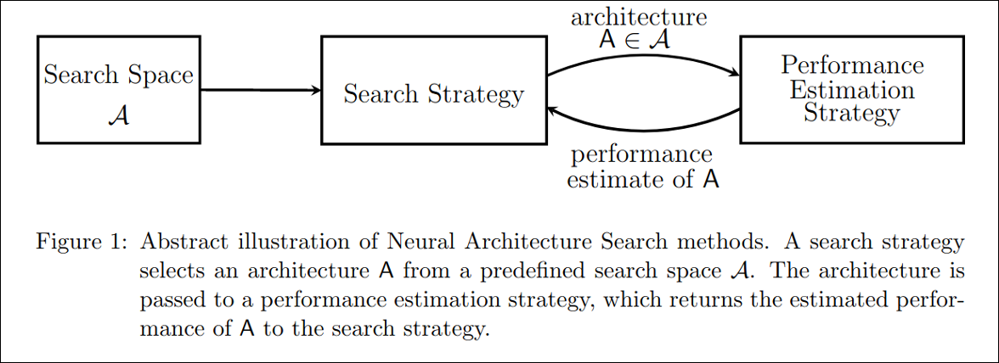
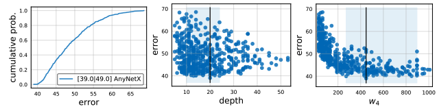
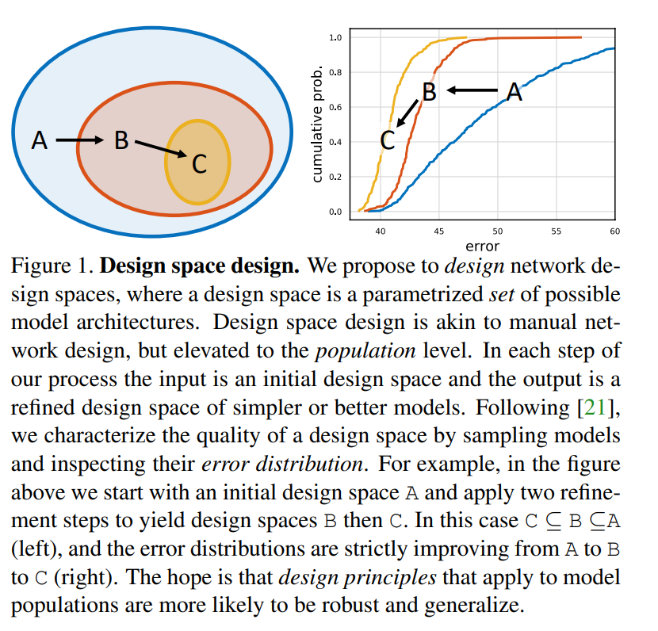
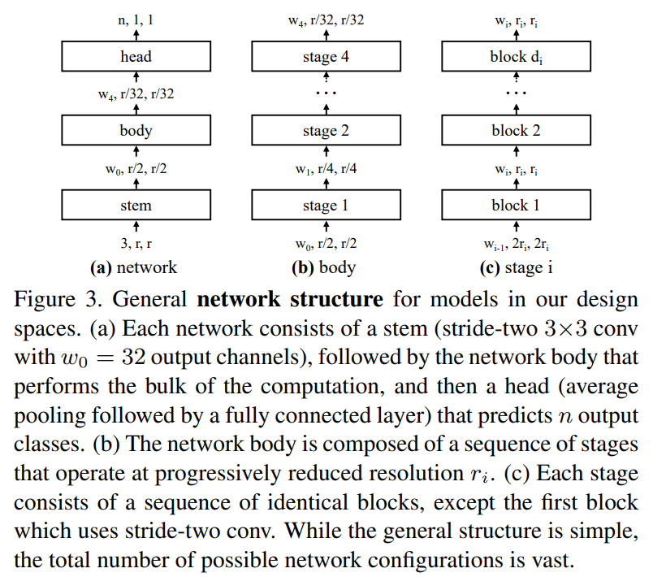

# RegNet

## Designing Network Design Spaces

RegNet은 EfficientNet보다 빠르고 성능이 좋은 모델이다. Tesla의 HydraNet에서도 RegNet을 사용했다. 

RegNet은 EfficientNet처럼 하나의 best model을 만드는 것이 아니라 뛰어난 모델을 어떤 세팅에서도 사용할 수 있도록 design space를 구성하는 것이 중심이다. design space 라는 것은 NAS에서의 search space와 유사한 의미지만, search space에서는 단 하나의 instance를 뽑아내는 것이 목표였다면, design space에서는 instance들을 뽑아내기 위한 space를 직접 찾아내는 것이 목표가 된다.

&nbsp;

최근에 architecture을 만드는 방법으로는 기본적인 방법인 manual 방식과 NAS(Neural Architecture Search) 방식이 많이 사용된다고 한다. Manual 방식은 모델을 직접 만드는 것을 의미하고, NAS는 특정 search space 안에서 좋은 모델을 자동으로 찾아서 사용하는 것을 의미한다. 자동으로 찾아준다는 것은 특정 세팅에만 적합한 single network를 만드는 것이므로 general하지 않다.

그래서 `Designing Network Design Spaces` 논문에서는 manual design과 NAS 방식의 장점을 조합한 새로운 디자인 패러다임을 제시한다.

1. Manual : 네트워크 구조가 심플하고 general한 모델을 생성
2. NAS : semi-automated procedure을 통해 자동적 모델 생성

&nbsp;

&nbsp;

## Neural Architecture Search(NAS)

NAS 나 design space에 대해 짧게 리뷰하고 넘어가려고 한다.

&nbsp;

&nbsp;

| [NAS 논문 : Neural Architecture Search with Reinforcement Learning](https://arxiv.org/abs/1611.01578)
| [NAS 참고 블로그1](https://ahn1340.github.io/neural%20architecture%20search/2021/04/26/NAS.html)
| [NAS 참고 블로그2 - 고려대학교 DMQM 연구실 세미나](http://dmqm.korea.ac.kr/activity/seminar/226)
| [NAS 참고 블로그3 - NAS with RL 논문 리뷰](https://pigranya1218.tistory.com/entry/%EB%85%BC%EB%AC%B8-%EB%A6%AC%EB%B7%B0-Neural-Architecture-Search-with-Reinforcement-Learning)
| [NAS 참고 논문1 : Neural Architecture Search: A Survey](https://arxiv.org/abs/1808.05377)

&nbsp;

딥러닝의 시대로 접어들면서 수많은 모델들이 나왔다. 이러한 모델들은 전문가들이 손수 hidden layer를 얼마나 쓸지, stride, padding 등의 정보들을 디자인한 결과이다. 구조를 보며 공부하며 자신의 task에 적용할 수는 있겠지만, task별로, 또는 어떤 데이터셋으로 구성되어 있냐에 따라 성능이 달라진다. 즉 전문가가 직접 디자인한 모델을 그대로 가져와 사용한다 해도 최적의 학습과 테스트가 이루어질 수는 없다는 뜻이다.

그렇다면, 모든 구조와 파라미터를 직접 공부하여 최적화해야 하는데, 이러한 과정이 올바른 과정일까? 과거에는 이런 방법들 밖에 없었지만, NAS 방법론을 통해 이러한 작업을 자동화하여 주어진 task에 가장 최적인 네트워크 구조를 빠르게 탐색할 수 있어졌다.

&nbsp;

NAS에서 가장 유명한 논문으로는 `Neural Architecture Search with Reinforcement Learning`(https://arxiv.org/abs/1611.01578)이다. NAS 방법론을 처음 제시한 논문으로 신경망의 구조를 가변길이의 문자열로 나타낼 수 있다는 점을 활용하여, 문자열로 신경망 구조를 출력하는 RNN controller(RL-agent)를 만들어, 실제 신경망을 생성한 후 각 네트워크에서 얻어진 accuracy를 RL의 reward로 취급하여 reward가 최대가 되는 문자열을 찾는다. 이 논문의 구조는 아래 사진과 같다.

&nbsp;

&nbsp;

### component of NAS

NAS는 크게 `Search Space`, `Search Strategy`, `Performance Estimation Strategy` 3가지 요소로 구성된다.

1. Search Space(탐색 공간)

    탐색 공간은 알고리즘이 탐색을 수행하는 영역으로, 여기서 `convolution`,`fully-connected`,`pooling` 등과 같은 연산들이 어떻게 연결되는지, 총 몇개의 연산이 네트워크를 구성하는지 정의한다.

    &nbsp;

2. Search Strategy(탐색 전략)

    탐색 전략은 탐색 공간상의 많은 operation(configuration)들 중 어떤 것이 가장 좋은 연산인지를 빠르고 효율적으로 찾아낸다. 탐색 전략에는 탐색 공간을 어떻게 정의하느냐, 목표가 무엇이냐에 따라 `random search`, `reinforcement learning`, `evolutionary strategy`, `gradient descent`, `bayesian optimization` 등의 방법을 사용할 수 있다.

    탐색 전략을 디자인할 때는 탐색 공간을 모두 탐색(exploration)하면서 좋은 부분을 찾아낼 수 있도록 해야 한다(exploitation). 보통은 이 둘은 trade-off 관계에 있어 디자인할 때 두 가지 모두를 잘 수행할 수 있도록 설정해야 한다.

    &nbsp;

    NAS에 evolutionary strategy를 사용하여 만든 모델인 [AmoebaNet](https://arxiv.org/abs/1802.01548)이 있다. search space로부터 랜덤하게 샘플링된 네트워크들의 variable를 학습시키고, 그중 loss가 가장 낮은 네트워크들의 구조에 random weight를 주어 학습시킨다.

    &nbsp;

    NAS에서 search space를 미분가능한 형태로 변환시켜 gradient descent를 수행한 논문도 있다. 이 논문의 이름이 `Differentiable Architecture Search`[DARTS](https://arxiv.org/abs/1806.09055)이다.

    &nbsp;

    &nbsp;

3. Performance Estimation Strategy(모델 성능 추정 전략)

    탐색 전략에서 여러 개의 후보 configuration을 추출하면 여기서 후보들의 성능을 예측하고, 그 예측치를 바탕으로 최적의 configuration으로 수렴할 때까지 반복 수행한다. 여기서 evaluate(평가)가 아닌 estimation(추정)인 이유는 모든 configuration을 일일히 학습시켜 평가하면 너무 많은 시간이 소요되므로 성능을 예측하여 최적의 전략을 찾아낸다.

&nbsp;

&nbsp;

## Tools for Design Space Design

다시 RegNet으로 돌아와서, design space를 어떻게 평가하는지에 대한 설명을 살펴본다. 단순히 manual과 같은 방식을 사용하거나 두 개의 design space로부터 각각 찾아낸 best 모델들의 성능을 비교하는 것보다 distribution 자체를 비교하는게 더 robust하다. 따라서 모델의 distribution을 얻기 위해 design space에서 n개의 모델을 샘플링하여 학습한다. 평가에는 EDF(Error empirical Distribution Function), 즉 각 모델의 error가 $ e_i $보다 작은 모델의 수에서 전체 모델의 수를 나눈다.

$ F(e) = \frac{1}{n} \sum_{i=1}^n 1[e_i < e] $

&nbsp;

위의 그림들은 500개의 샘플링된 모델에 대한 그래프이다. 중간과 오른쪽 그래프는 다양한 네트워크의 속성들을 살펴볼 수 있다.

&nbsp;

추정하는 과정은 다음과 같다.

1. 디자인 공간으로부터 n개의 모델을 샘플링하고 학습하여 모델의 분포를 얻는다.
2. EDF를 사용해 디자인 공간을 평가하고 시각화한다.
3. 디자인 공간의 속성을 통해 insight를 얻는다.
4. insight를 통해 다시 디자인 공간을 재정의하여 더 나은 디자인 공간을 만든다.

&nbsp;

&nbsp;

&nbsp;

## The AnyNet Design Space

## reference
- regNet
    - Designing Network Design Spaces, Ilija Radosavovic(2020) (arXiv:2003.13678)
    - https://towardsdatascience.com/regnet-the-most-flexible-network-architecture-for-computer-vision-2fd757f9c5cd
    - https://2-chae.github.io/category/2.papers/31
    - https://cocopambag.tistory.com/47

